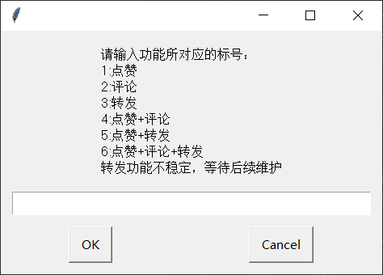

# 环境要求

+ Python 3.x
+ 安装pyautogui模块：`pip install pyautogui`

# 启动

+ python main.py

# 功能模块

# 目录结构

+ qzone_zan.py   #点赞模块
+ qzone_pl.py      #评论模块
+ qzone_zf.py      #转发模块
+ qzone_pl.txt     #自定义的评论内容

# 说明

+ 项目地址：https://github.com/LeeJony000/auto_thumbs-up_comment_forward

+ 其他：本项目是根据PC端的QQ空间设计的自动点赞评论转发脚本，但大体框架已经给出，如有其他需要，可以根据代码进行小部分修改即可满足其他需求，例如给CSDN文章点赞评论，微信点赞评论等
